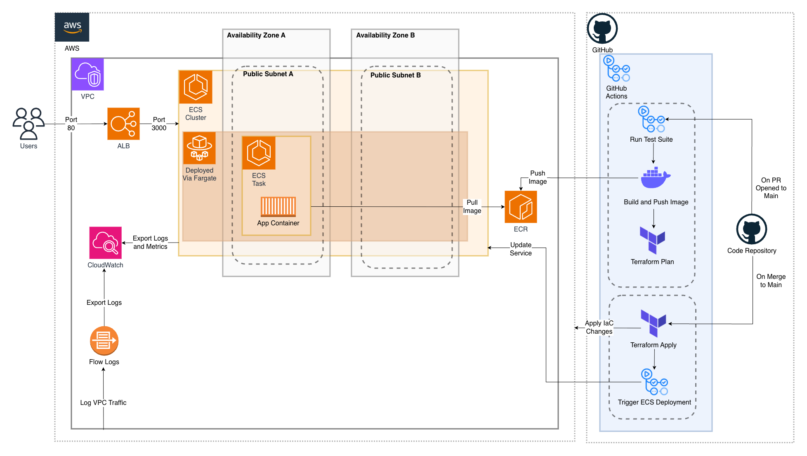

# Deswik Take Home DevOps Test
I have assumed that these are two completely separate challenges and thus the implementation challenge does not use the design from the design challenge.


# Part 1: Design Challenge
Please see design.md for details.

# Part 2: Implementation Challenge
A minimal containerised Hello World web application deployed to AWS ECS Fargate with a full CI/CD pipeline using GitHub Actions and Terraform.

## High Level Architecture


## Making Changes to Current Deployment
Infrastructure is live on AWS and GitHub Actions is configured on this repo. To make changes, simply open a PR to main — the CI pipeline will validate and build your changes, then on merge the CD pipeline will deploy them automatically. The detailed steps are as follows:

### 1. Create a new branch
After cloning the repo to your local environment run:

```bash
git checkout -b your-branch-name
```

### 2. Make your changes
| Type of change | Files to edit |
|---|---|
| App code | `app/server.js` |
| Container | `app/Dockerfile` |
| Infrastructure | `terraform/*.tf` |
| CI/CD Pipeline | `.github/workflows/deploy.yml` |

### 3. Push and open a PR
```bash
git add .
git commit -m "your commit message"
git push origin your-branch-name
```

Then open a PR on GitHub targeting `main`. Please aim to use [Conventional Commits](https://www.conventionalcommits.org/en/v1.0.0/). 

### 4. CI pipeline runs automatically
On every PR the following checks run:
- Dockerfile lint
- Node.js syntax check
- Docker build and push to ECR
- Terraform fmt, validate and plan

Fix any failures before merging.

### 5. Merge to deploy
Once CI is green, merge the PR. The CD pipeline will automatically:
1. Run terraform apply
2. Force a new ECS deployment to pull the latest Docker image

### 6. Verify
Once deployed, verify the application is running at:

http://deswik-alb-471948303.ap-southeast-2.elb.amazonaws.com/


## Fresh Deployment
Follow these steps to deploy from scratch into your own AWS and GitHub account.

### Prerequisites
- [AWS CLI](https://docs.aws.amazon.com/cli/latest/userguide/install-cliv2.html) installed and configured
- [Terraform](https://developer.hashicorp.com/terraform/install) installed
- [Docker](https://docs.docker.com/get-docker/) installed
- An AWS account with sufficient permissions
- A fork of this repo cloned to your local environment
- Local environment is connected to your AWS account via "[aws configure](https://docs.aws.amazon.com/cli/latest/reference/configure/)"

### 1. Bootstrap Terraform state
Terraform requires an S3 bucket and DynamoDB table to store remote state. Create these in your AWS account.
```bash
aws s3api create-bucket \
  --bucket BUCKET_NAME \
  --region ap-southeast-2 \
  --create-bucket-configuration LocationConstraint=ap-southeast-2

aws dynamodb create-table \
  --table-name terraform-state-lock \
  --attribute-definitions AttributeName=LockID,AttributeType=S \
  --key-schema AttributeName=LockID,KeyType=HASH \
  --billing-mode PAY_PER_REQUEST \
  --region ap-southeast-2
```

Then update `terraform/backend.tf` with your bucket name.

### 2. Bootstrap ECR
The CI/CD pipeline pushes Docker images to ECR, but ECR must exist before the pipeline runs. Create it manually once:
```bash
aws ecr create-repository \
  --repository-name deswik-app \
  --region ap-southeast-2
```

### 3. Configure GitHub Actions secrets
Add the following secrets to your GitHub repo (Settings → Secrets and variables → Actions):

| Secret | Value |
|---|---|
| `AWS_ACCESS_KEY_ID` | Your AWS access key ID |
| `AWS_SECRET_ACCESS_KEY` | Your AWS secret access key |
| `AWS_REGION` | `ap-southeast-2` |

### 4. Bootstrap Infrastructure
Run `terraform apply` locally to provision all AWS infrastructure before the CI/CD pipeline runs for the first time:
```bash
cd terraform
terraform init
terraform apply
```

Once complete, note the `alb_dns_name` output — this is the URL of your deployed application.

Alternatively, pushing a commit directly to main will trigger the CD pipeline to deploy all infrastructure automatically. The ALB DNS name can then be found in the AWS Console under EC2 → Load Balancers.

### 5. Push to main to trigger deployment
From this point, all deployments are handled automatically by the CI/CD pipeline. Open a PR to make changes and merge to deploy:
```bash
git push origin main
```

The CD pipeline will run `terraform apply` and deploy the latest Docker image to ECS on every merge to main.


## Observability
| Resource | Where to find it |
|---|---|
| CloudWatch Dashboard | AWS Console → CloudWatch → Dashboards → deswik-dashboard |
| Container Logs | AWS Console → CloudWatch → Log Groups → /ecs/deswik-app |
| VPC Flow Logs | AWS Console → CloudWatch → Log Groups → /vpc/deswik-flow-logs |
| CPU Alarm | AWS Console → CloudWatch → Alarms → deswik-ecs-cpu-high |
| GuardDuty Findings | AWS Console → GuardDuty → Findings |
