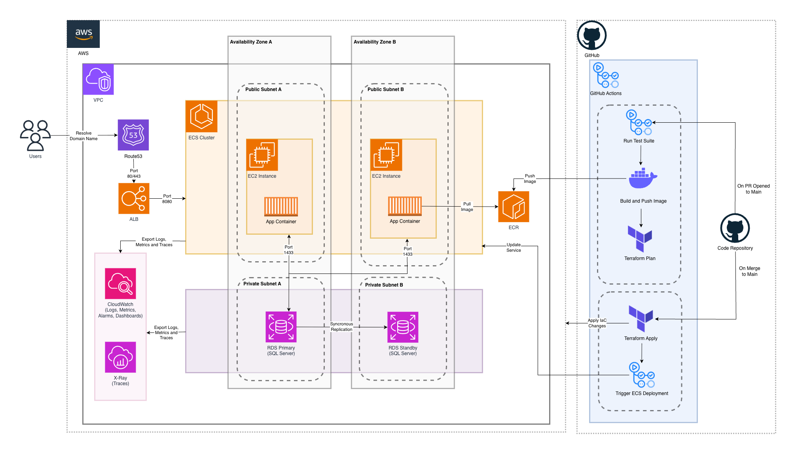

# .NET Application AWS Migration MVP

## High Level Overview
The application runs on ECS-orchestrated containers on EC2, with images stored in ECR and data in RDS (SQL Server). Legacy data is migrated via AWS DMS. All resources sit within a VPC, segmented into public/private subnets across two AZs for security and high availability. Users connect via a domain name, which Route 53 resolves to an ALB that distributes traffic across ECS tasks. Infrastructure and Dockerfiles live in GitHub, with CI/CD via GitHub Actions — CI triggers on PR to Main (tests, builds/pushes image to ECR, outputs Terraform plan), CD triggers on merge (Terraform apply, ECS deployment). Observability is provided by CloudWatch (logs/metrics) and X-Ray (distributed tracing).

### MVP Final High Level Architecture
Security services (ACM, Secrets Manager, IAM, Security Groups) and the DMS migration architecture are omitted from this diagram for brevity — both are detailed in the sections below.

## Core Infrastructure
### Compute and Containers
- **ECS**: Manages container orchestration — lower operational overhead than EKS, which would be overkill for a single .NET application MVP.
- **EC2**: Hosts the containers. Chosen over Fargate for greater control and cost-effectiveness given a predictable MVP workload.
### Networking
- **VPC**: Isolates all infrastructure, controlling public/private access and inter-resource communication.
- **Subnets**: Two public and two private subnets across two AZs — minimises exposure per resource (e.g. RDS in private) and enables high availability.
- **ALB**: Spans both public subnets, acting as the single entry point and distributing traffic across ECS tasks.
- **Route 53**: Resolves the application domain to the ALB IP, abstracting any IP changes from users.
### Data
- **RDS (SQL Server)**: Direct AWS equivalent of the legacy database, ensuring application compatibility. Preferred over self-hosting on EC2 as AWS manages backups, patching, and failover. A synchronous standby replica in a separate AZ provides resilience.
### Observability
- **CloudWatch**: Aggregates logs and metrics across all resources. Dashboards and alerts on key metrics enable proactive incident response.
- **X-Ray**: Distributed tracing to identify latency bottlenecks. ServiceLens integrates traces into CloudWatch for unified observability.
### Post MVP
- Expand from two to three AZs for maximum resilience in production.
- Run cost-benefit analysis on EC2 vs Fargate for production workloads.
- Consider Aurora migration if greater performance and scalability are needed (requires moving from SQL Server to MySQL/PostgreSQL).

## Data Migration
The application will be migrated to ECS first, keeping it pointed at the legacy database, then the database migrated separately once the application layer is stable — minimising risk by changing one thing at a time.
1. **Provision RDS**: Set up the RDS SQL Server instance in private subnets.
2. **Configure DMS**: Set up a replication instance with source (legacy SQL Server) and target (RDS) endpoints.
3. **Full Load**: DMS copies all existing data to RDS.
4. **CDC (Change Data Capture)**: Continuously captures source changes during the full load so no data is lost.
5. **Validate**: Confirm RDS data matches the source once full load and CDC are in sync.
6. **Cutover**: Re-point the application to RDS and decommission the legacy database.

## Security
- **ACM**: Provides the SSL/TLS certificate for HTTPS traffic on the ALB (port 443).
- **Secrets Manager**: Stores all sensitive credentials (DB passwords, connection strings) — nothing hardcoded.
- **Security Groups**: Least-privilege per service — ALB accepts 80/443, ECS accepts from ALB on 8080, RDS accepts from ECS on 1433.
- **IAM**: Least-privilege roles per service — e.g. ECS task role scoped to ECR pull, Secrets Manager read, and CloudWatch write.
### Post MVP
- Move ECS tasks from public to private subnets behind a NAT Gateway to prevent direct external connections.

## CI/CD Pipeline
### Tools
- **ECR**: Stores Docker images with native ECS integration and built-in image scanning.
- **Terraform**: Manages all AWS infrastructure as code — version controlled, peer reviewed, and automatically deployed.
- **GitHub Actions**: Runs pipelines within the existing repository — no separate tooling server required.

### Pipelines
- **CI/Build Pipeline**: Triggers on PR to Main — runs tests/linting/security checks, builds and pushes Docker image to ECR, outputs Terraform plan for review.
- **CD/Deploy Pipeline**: Triggers on merge to Main — runs Terraform apply and deploys the new image to ECS.